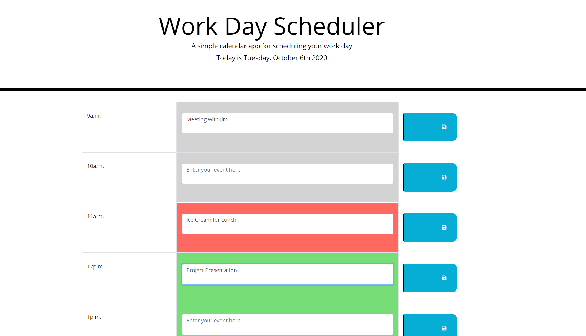

# Work Day Scheduler

This project is a scheduling tool to be used for the hours of a typical 9-5 workday.
A memo can be entered into each hour slot and then saved to local storage with the save button on the right-hand side.

Each hour's corresponding row will change color based how it relates to the current time of day:
  *Green if the hour is in the future
  *Gray if hour has passed
  *Red is for if the the hour is the current time

## Example Photo

## Usage

In order to run this application you can either visit the Github pages link or clone the repo and open the index.html file in your favorite browser.
Thanks for Viewing!